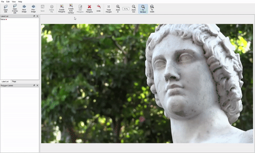

## Description

Smart-Labelme is a graphical image annotation tool for various image annotation needs such as classification, semantic segmentation, polygonal rois etc.  
It support some smart features like annotation tracking, auto contouring etc. to speed up annotation task.
It is written in Python and uses Qt for its graphical interface.

<i>Auto contouring feature using OpenCV grab cut</i>
   

<i>Auto tracking of polygons between frames</i>
   


## Requirements

- Ubuntu / macOS / Windows
- Python2 / Python3
- [PyQt4 / PyQt5](http://www.riverbankcomputing.co.uk/software/pyqt/intro) / [PySide2](https://wiki.qt.io/PySide2_GettingStarted)


## Installation
Download the source code onto your local system.
Build package using python setup tool.
Install the package on your system using pip.

```bash
git clone https://github.com/yanxi853600/smart-label
cd smart-labelme
python setup.py build
pip install .
```

## Usage

Run `smart_labelme --help` for detail.  
The annotations are saved as a [JSON](http://www.json.org/) file.

```bash
smart_labelme  # just open gui
```

or
```bash
python labelme/__main__.py
```

### Command Line Arguments
- `--output` specifies the location that annotations will be written to. Annotations will be stored in this directory with a name that corresponds to the image that the annotation was made on.
- The first time you run labelme, it will create a config file in `~/.labelmerc`. You can edit this file and the changes will be applied the next time that you launch labelme. If you would prefer to use a config file from another location, you can specify this file with the `--config` flag.
- Without the `--nosortlabels` flag, the program will list labels in alphabetical order. When the program is run with this flag, it will display labels in the order that they are provided.
- Flags are assigned to an entire image. 
- Labels are assigned to a single polygon.

## Acknowledgement

This repo is the fork of [bhavyaajani/smart-labelme](https://github.com/bhavyaajani/smart-labelme).
And do some adjustment inside.


